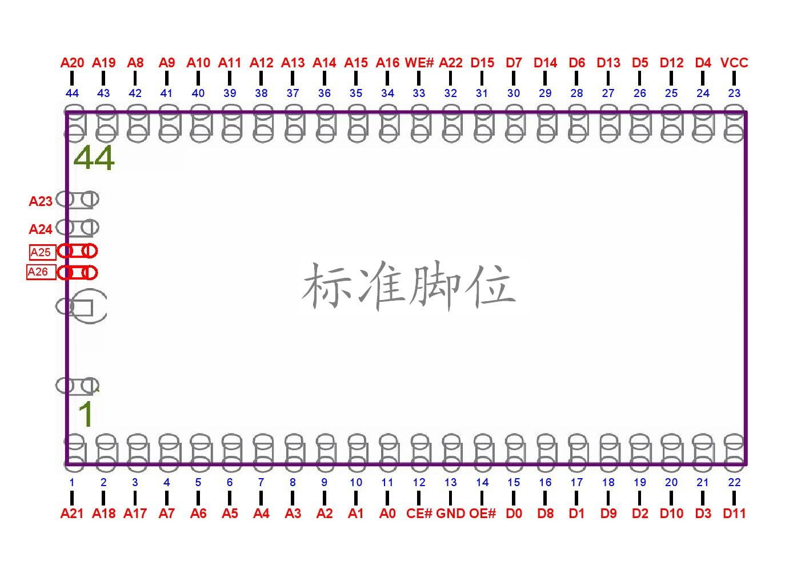

# 🎮 SUP Game Box 400-in-1 – Reverse Engineering Project

> *Dumping, Analyzing & Customizing the ROM of a Retro Handheld Console*

---

## 📌 Project Overview

Hello! I'm **Daniel**, an 11‑year‑old security researcher and reverse engineer.  
This project is my journey to **dump the original ROM** of the **SUP Game Box 400-in-1** console, analyze its structure, and eventually create a **custom firmware** with my favorite games.

---

## 🧠 About the Console

The **SUP Game Box 400-in-1** is an inexpensive handheld gaming device that includes 400 built‑in games (many of them duplicates).  
It uses a special architecture called **OneBus**, which is essentially a clone of the classic NES (Famicom) architecture.

### 🔍 Technical Specifications

| Component | Details |
|-----------|---------|
| **Processor** | NOAC (NES-on-a-Chip) – hidden under epoxy blob |
| **Memory Chipset** | STMicroelectronics **M36L0T7050** (16 MB Flash + 4 MB PSRAM) |
| **Display** | TFT screen (model varies, I identified **GC9306**) |

---

## 📄 Datasheet Reference

> Below is the **pinout diagram** of the M36L0T7050 chipset, which is essential for understanding how to interface with the memory:

*This image shows the pin mapping used to connect the chipset to the Arduino for dumping.*

---

## 🛠️ My Journey So Far

### 🔌 Step 1 – USB Discovery
Unlike others, I didn't open the console first. I inspected the **USB socket** and discovered that its pins are connected to both the memory chipset and the processor.  
This means the USB port is **not just for charging** – it has a hidden data path!

Using an **Arduino Nano** and a cut USB cable, I started sending data and... **Mario jumped!**  
I could control the console via USB!

### ⚡ Step 2 – The Big Challenge
Although I could send data, **receiving data** from the console was difficult.  
I realized the console only sends a signal at boot time and then disconnects.  
So, to dump the ROM, I had to send the **right commands** at the **right moment**.

### 🔧 Step 3 – Opening the Console
After many trials with USB, I decided to **open the console** and access the memory chipset directly.  
With the help of a professional repairman, I safely removed the **M36L0T7050** chipset from the board using **ChipQuik** alloy.

---

## 📊 Challenges Faced

| Challenge | Solution / Status |
|-----------|-------------------|
| Finding the datasheet | ✅ Found the complete M36L0T7050 datasheet |
| USB communication | ✅ Proved USB is a hidden data path |
| Receiving data at boot | ⏳ Need to send precise commands at boot time |
| Removing the chipset | ✅ Done – safely removed with ChipQuik |
| SOP‑44 to DIP adapter | ⏳ Need to get or build one to connect to Arduino |

---

## 📋 My Plan for the Future

1. **Get a SOP‑44 to DIP adapter** (or build one using a breadboard and wires)
2. **Connect the chipset to Arduino** and take a full 16 MB dump
3. **Analyze the dump** with a hex editor to find game and menu structures
4. **Create a custom ROM** with my favorite games (like Goal 3, Super Mario Bros 3, etc.)
5. **Write (Flash) the new ROM** back to the chipset
6. **Reinstall the chipset** onto the board with the help of a repairman

---

## 💡 What I've Learned

- How to read and understand hardware datasheets
- How to communicate with Arduino using low‑level code
- How to find hidden functionalities in consumer devices
- How to work with professional repairmen for delicate hardware tasks
- How to learn from failures and keep moving forward

---

## ⚠️ Disclaimer

> This is a **personal research project** for learning and fun.  
> Hardware manipulation is risky and may permanently damage the device.  
> I do this for educational purposes only.

---

## 📬 Contact

**Daniel Baradaran**  
🔗 [GitHub](https://github.com/danieldevir) ·
📧 daniel.ir.dev@gmail.com

---

*Stay curious. Stay kind.* 🌟
